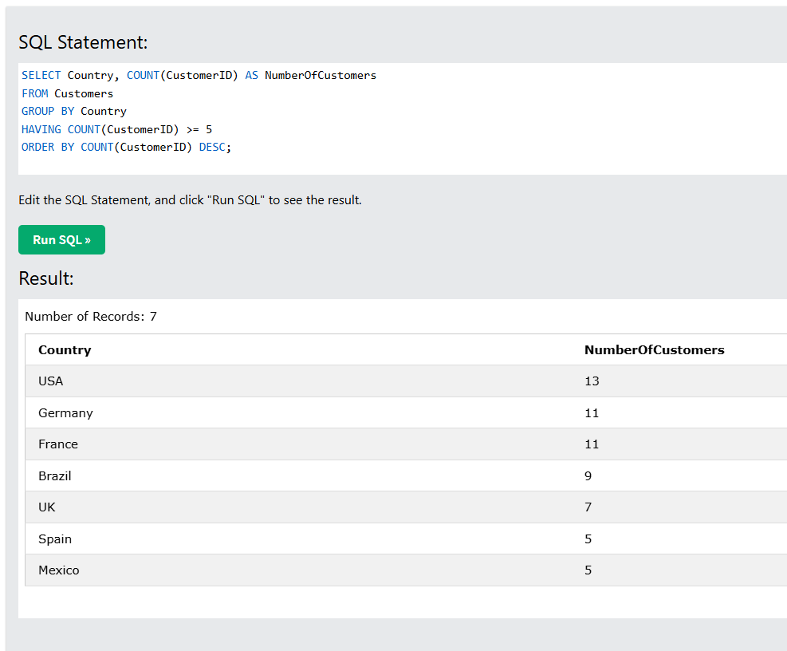

# Sentech - Technical Assessment & Portfolio

This repository contains a collection of answers and implementation examples for various software development aspects, from database queries to best practices for website security and performance.

## 📋 Table of Contents

- [Database Questions](#database-questions)
- [JavaScript/TypeScript](#javascripttypescript)
- [Vue.js](#vuejs)
- [Website Security Best Practices](#website-security-best-practices)
- [Website Performance Best Practices](#website-performance-best-practices)
- [Golang](#golang)
- [Tools & Technologies](#tools--technologies)

---

## Database Questions

### Level 1 (Novice - Expected Task Time: 1 minute)
Count the number of customers from a specific country.

```sql
SELECT COUNT(*) AS NumberOfCustomers
FROM Customers
WHERE Country = 'Germany';
```

### Level 2 (Business Admin - Expected Task Time <4 minutes)
Display countries with a minimum of 5 customers, ordered by the highest number of customers.

```sql
SELECT Country, COUNT(CustomerID) AS NumberOfCustomers
FROM Customers
GROUP BY Country
HAVING COUNT(CustomerID) >= 5
ORDER BY COUNT(CustomerID) DESC;
```

### Level 3 (Average Developer - Expected Task Time <8 minutes)
Display complete customer information with a minimum of 5 orders, including first and last order dates.

```sql
SELECT 
    Customers.CustomerName,
    COUNT(Orders.OrderID) AS OrderCount,
    FORMAT(MIN(Orders.OrderDate), 'yyyy-mm-dd') AS FirstOrder,
    FORMAT(MAX(Orders.OrderDate), 'yyyy-mm-dd') AS LastOrder
FROM Customers
INNER JOIN Orders ON Customers.CustomerID = Orders.CustomerID
GROUP BY Customers.CustomerName
HAVING COUNT(Orders.OrderID) >= 5
ORDER BY MAX(Orders.OrderDate) DESC;
```

---

## JavaScript/TypeScript

### Level 1
**Expected Task Time:** <15 minutes  
**File:** [`javascript/level_1.js`](javascript/level_1.js)

### Level 2
**Expected Task Time:** 1 minute  
**File:** [`javascript/level_2.js`](javascript/level_2.js)

### Level 2.5
**Task:** Rewrite using Async/Await  
**File:** [`javascript/level_2_5.js`](javascript/level_2_5.js)

---

## Vue.js
This is my first time using vuejs


**Dir:** [`realtime_chat`](realtime_chat)

---

## Website Security Best Practices

### 1. Identity & Access Management (IAM)
- Apply the **least privilege** principle to every user and service
- Store credentials in **Secret Manager**, never hardcode in code or repositories

### 2. Encryption
- **Encrypt data at rest:** databases, storage
- **Encrypt data in transit:** enforce HTTPS (TLS 1.2/1.3) for all external communication
- Use encrypted protocols (e.g., gRPC/TLS, mTLS) for service-to-service communication

### 3. Network & Infrastructure Security
- Segment environments (dev, staging, prod) to minimize blast radius
- Place services in a dedicated VPC for internal communication with databases
- Enforce firewalls / security groups to only allow necessary ports and trusted IPs
- Restrict direct access to databases; all queries should go through the backend

### 4. API Security
- Enforce authorization mechanisms:
  - JWT tokens for users/sessions
  - API keys or OAuth2 for service-to-service communication
- Implement rate limiting and throttling on the backend to prevent abuse
- Validate signatures or HMACs for third-party integrations

### 5. Application & Code Security
- Sanitize and validate all inputs to prevent SQL injection, XSS, and command injection
- Use ORMs or prepared statements for database queries
- Never trust client input — always re-validate on the server

---

## Website Performance Best Practices

Here are the best practices for website performance, ordered by importance:

### 1. CDN, Compression, Caching (Network Layer)
- Implement Content Delivery Network (CDN)
- File compression (Gzip, Brotli)
- Caching at various layers (browser, CDN, server)

### 2. Smaller Payloads
- Minify CSS, JavaScript, and HTML
- Modern image optimization (WebP, AVIF)
- Bundle splitting to reduce initial load size

### 3. Fast Rendering
- Critical CSS for above-the-fold content
- Lazy loading for images and components
- Prevent layout shifts (CLS)

### 4. Optimized Backend Delivery
- Optimize database queries and indexing
- Optimize API payloads
- Implement CQRS pattern
- Caching with Redis or Memcache

### 5. Continuous Monitoring
- Continuously monitor Core Web Vitals
- Setup alerting for performance degradation
- Regular performance audits

---

## Golang

### String Converter
**File:** [`golang/string_converter.go`](golang/string_converter.go)  
**Demo:** [Go Playground](https://goplay.tools/snippet/AfLQb2KrCVb)

---

## Tools & Technologies

Tool and technology proficiency rating (Scale 1-5):

| Tool/Technology | Rating | Description |
|-----------------|--------|-------------|
| **Git** | 5 | Expert level |
| **Redis** | 5 | Expert level |
| **VSCode** | 5 | Primary IDE |
| **Linux** | 3 | Deployment only, not for daily use |
| **AWS** | 3 | Currently actively using GCP, previously used AWS |
| **EC2** | 4 | Good understanding |
| **Lambda** | 4 | Good understanding |
| **RDS** | 4 | Good understanding |
| **CloudWatch** | 4 | Good understanding |
| **S3** | 4 | Good understanding |
| **Unit Testing** | 4 | Good understanding |
| **Kanban Boards** | 5 | Expert level |

---

## 📁 Project Structure

```
sentech/
├── golang/
│   └── string_converter.go
├── javascript/
│   ├── level_1.js
│   ├── level_2.js
│   └── level_2_5.js
├── realtime_chat/
│   ├── src/
│   ├── server/
│   └── dist/
└── README.md
```

---

## 🚀 Getting Started

1. Clone this repository
2. Navigate to the appropriate folder for the technology you want to learn
3. Follow the instructions in each file to run the examples

---
